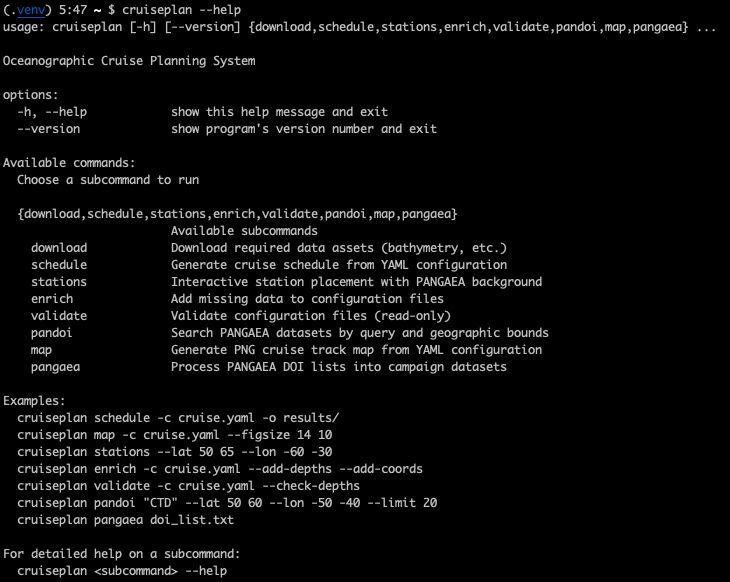

CLI Command Reference
=====================

This document provides a comprehensive reference for the `cruiseplan` command-line interface, detailing available subcommands and their required and optional arguments.

General Usage
-------------

The `cruiseplan` CLI uses a "git-style" subcommand architecture.

.. code-block:: bash

    usage: cruiseplan [-h] [--version] {download,schedule,stations,enrich,validate,pandoi,map,pangaea} ...

**Options:**

.. list-table::
   :widths: 30 70

   * - ``-h, --help``
     - Show the program's main help message and exit.
   * - ``--version``
     - Show the program's version number and exit.

**Workflow**

The general workflow follows these steps in order:

1. **Data preparation:** :doc:`cli/download` - Download bathymetry and external datasets
2. **Historical integration:** :doc:`cli/pandoi` - Search PANGAEA datasets by query and bounds  
3. **Historical integration:** :doc:`cli/pangaea` - Process PANGAEA DOI lists into campaign datasets
4. **Cruise configuration:** :doc:`cli/stations` - Interactive station planning interface
5. **Cruise configuration:** :doc:`cli/enrich` - Add depths, coordinates, and expand sections
6. **Cruise configuration:** :doc:`cli/validate` - Validate configuration files
7. **Cruise configuration:** :doc:`cli/map` - Generate standalone PNG cruise maps
8. **Schedule generation:** :doc:`cli/schedule` - Generate cruise timeline and outputs

**Examples:**

The command-line interface provides eight main subcommands for different aspects of cruise planning.

.. code-block:: bash

    $ cruiseplan download 
    $ cruiseplan pandoi "CTD" --lat 50 60 --lon -50 -40 --limit 20 -o data/cruise1/
    $ cruiseplan pangaea doi_list.txt -o data/cruise1/
    $ cruiseplan stations --lat 50 65 --lon -60 -30 -o data/cruise1/
    $ cruiseplan enrich -c data/cruise1/cruise.yaml --add-depths --add-coords
    $ cruiseplan validate -c cruise.yaml --check-depths
    $ cruiseplan map -c cruise.yaml --figsize 14 10
    $ cruiseplan schedule -c cruise.yaml -o results/

   
   Complete overview of CruisePlan CLI commands and their purposes

----

Subcommands
-----------

.. note:: For detailed help on any subcommand, use: ``cruiseplan <command> --help``

.. toctree::
   :maxdepth: 1
   :caption: CLI Subcommands

   cli/download
   cli/pandoi
   cli/pangaea
   cli/stations
   cli/enrich
   cli/validate
   cli/map
   cli/schedule