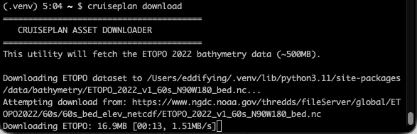
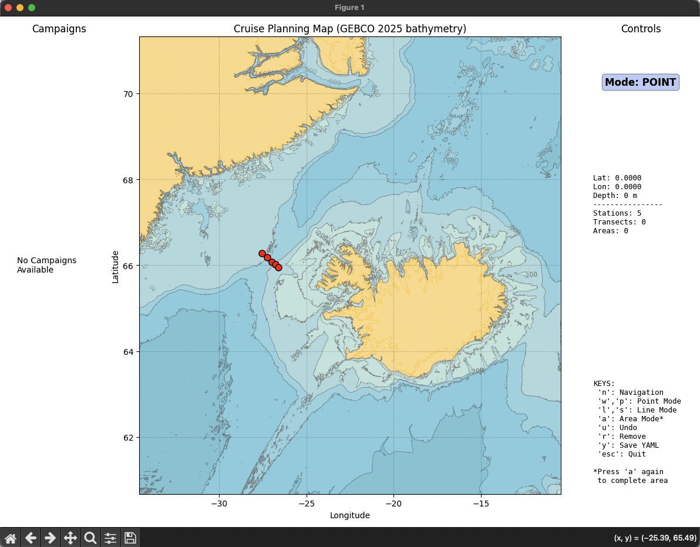
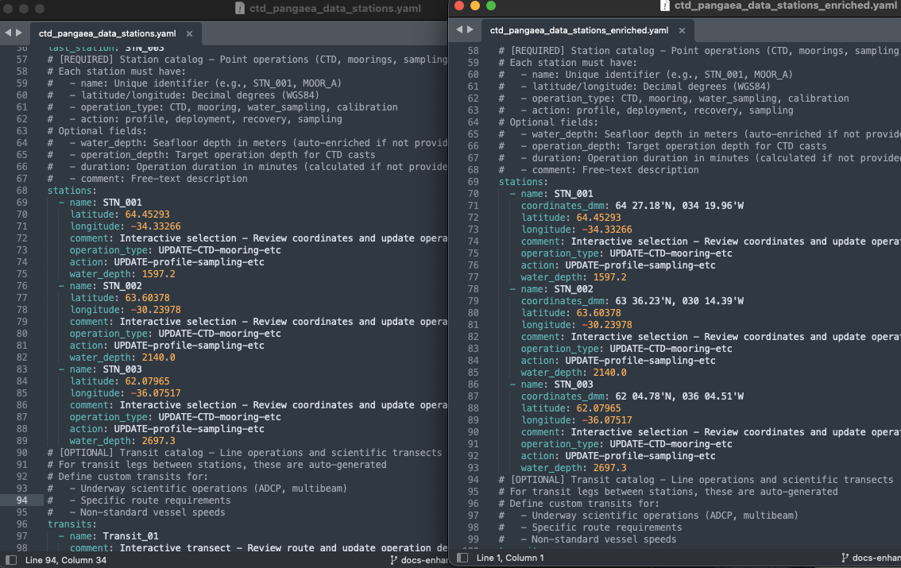
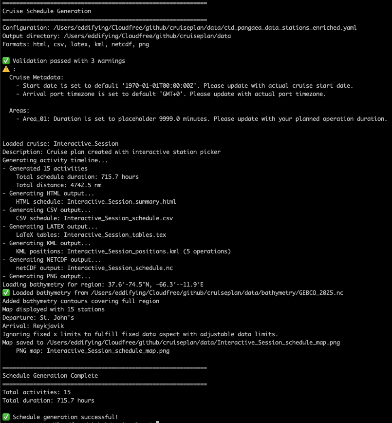

Overview
========

This guide provides step-by-step workflows for planning oceanographic cruises with CruisePlan, from initial setup through schedule generation.

CruisePlan follows a multi-step workflow where each command builds upon the previous step's outputs. The system is designed to separate concerns: data preparation, station planning, configuration details, and scheduling.

**Core Philosophy:**

- **Modular**: Each step has a specific purpose and clear inputs/outputs
- **Flexible**: Multiple workflow paths depending on your data needs
- **Manual Control**: Key decisions require explicit user input
- **Validation**: Built-in checks ensure data quality throughout

Quick Reference
---------------

.. list-table:: Command Flow Summary
   :widths: 15 25 25 25 15
   :header-rows: 1

   * - **Command**
     - **Purpose**
     - **Input**
     - **Output**
     - **File type**
   * - ``download``
     - Get bathymetry data
     - User choice (ETOPO, GEBCO))
     - NetCDF files in ``data/``
     - `*.nc`
   * - ``pandoi``
     - Search PANGAEA
     - Search terms + bounds
     - DOI list file
     - Text file
   * - ``pangaea``
     - Process historical station information
     - DOI list file
     - Pickled station database
     - `*.pkl`
   * - ``stations``
     - Interactive planning
     - Optional PANGAEA pickle
     - Stub YAML configuration
     - `*.yaml`
   * - ``enrich``
     - Add metadata
     - Stub YAML
     - Complete YAML with depths
     - `*.yaml`
   * - ``validate``
     - Check configuration
     - YAML file
     - Validation report
     - Text output     
   * - ``map``
     - Visualize cruise plan
     - YAML file
     - Map figure
     - `*.png`, `*.pdf`
   * - ``schedule``
     - Generate outputs
     - Valid YAML
     - Timeline & deliverables
     - Multiple formats

Prerequisites
-------------

Before starting any workflow, ensure you have:

1. **CruisePlan installed** with all dependencies
2. **Internet connection** for downloading bathymetry data
3. **Sufficient disk space**:

   - ETOPO 2022: ~500MB (recommended to start)
   - GEBCO 2025: ~7.5GB (high-resolution option)

  .. _download_bathymetry:

Download bathymetry
...................

.. code-block:: bash

   # Download default bathymetry (ETOPO 2022 - recommended)
   cruiseplan download
   
   # OR download high-resolution bathymetry (larger download)
   cruiseplan download --bathymetry-source gebco2025

**What this does:**

- Downloads global bathymetry dataset to ``data/bathymetry/`` (or specified directory, using `-o` flag)
- Enables depth lookups in subsequent steps

**Storage requirements:**

- ETOPO 2022 (~500MB): 1-arc-minute resolution, suitable for most open ocean work
- GEBCO 2025 (~7.5GB): 15-arc-second resolution, better for coastal/slope areas

   
   Bathymetry download process showing progress bars

⚠️ **Important**: Having a valid bathymetry file is an important step for all workflows.  While it is possible to operate without, this is used for determining station depths for CTDs and makes using the station picker much more straightforward.

💡 **Smart Fallback**: Note that ETOPO 2022 is the default if not specified.   If you haven't downloaded ETOPO 2022  but have GEBCO 2025 available, CruisePlan will automatically detect and use the available bathymetry source.  

Workflow Paths
--------------

Choose your workflow based on your planning needs:

:ref:`user_workflow_path_1` (General usage)
   Use when you want to plan stations from scratch without historical context

:ref:`user_workflow_path_2` (PANGAEA-enhanced for historical context)
   Use when you want to incorporate historical station positions from PANGAEA, i.e. to compare a section with past occupations

:ref:`user_workflow_path_3` (Configuration-only to iterate & refine)
   Use when you already have a YAML configuration and need to process it

Best Practices
--------------

1. **Start simple:** Begin with basic CTD stations before adding complex operations
2. **Use PANGAEA data:** Historical context improves station placement decisions  
3. **Validate often:** Run validation after each major edit to catch issues early
4. **Test scheduling:** Generate test schedules to check feasibility

----

.. _user_workflow_path_1:

Path 1: Basic Planning Workflow
================================

**Best for:** First-time users, simple cruises, when historical data is not needed

**Time required:** 30-60 minutes to create a first draft of a cruise

---- 

Step 1: Download Bathymetry Data
---------------------------------

**Purpose:** Provides depth information for station planning and automatic depth enrichment.

Essential first step:  :ref:`download_bathymetry`.  You've succeeeded when you have the file ``data/bathymetry/ETOPO_2022_v1_60s_N90W180_bed.nc`` available.  When in doubt, start with the ETOPO (default) only. 

.. figure:: _static/screenshots/data_directory_structure.png
   :alt: Bathymetry data directory structure showing downloaded files
   :width: 600px
   :align: center
   
   Directory structure (Mac OS Finder) showing bathymetry files in ``data/bathymetry/``

.. note::
  See :ref:`Download subcommand CLI reference <subcommand-download>` in :doc:`cli_reference` for full options and examples.

----

Step 2: Interactive Station Planning
------------------------------------

**Purpose:** Visually select station locations using an interactive map interface.

.. code-block:: bash

   cruiseplan stations --lat 45 70 --lon -65 -5 -o output_dir
   
This will plot a map within the region specified (or defaults to the subpolar North Atlantic if not specified), and add contours of bathymetry.  It has various input modes for cruise activities at fixed points (stations), along lines (transects) or within areas (box surveys).  The navigation mode allows panning and zooming to explore the map without accidently clicking to add stations.

.. figure:: _static/screenshots/station_picker_startup.png
   :alt: Station picker interface showing three-panel layout
   :width: 800px
   :align: center
   
   Interactive station picker interface with map, controls, and status panels  

**Interactive Controls:**

Four modes of inputs:

- ``p`` or ``w``: Place point stations (CTD stations, moorings)
- ``l`` or ``s``: Draw line transects (underway surveys)
- ``a``: Define area operations (box surveys)
- ``n``: Navigation mode (pan/zoom)

.. figure:: _static/screenshots/station_picker_point_mode.png
   :alt: Station picker in point placement mode
   :width: 700px
   :align: center
   
   Point placement mode for adding individual stations (CTD, moorings).  Note the status in the upper right corner has changed to "Mode: Point".

Additional commands can be used anytime:

- ``u``: Undo last operation
- ``r``: Remove operation (click to select)
- ``y``: Save to YAML file
- ``Escape``: Exit without saving

   
   Example cruise plan with multiple stations showing position on the map.
   
   
.. warning::
  If you don't specify an output file, the command will create ``stations.yaml`` in the default directory (``./data``). Running the command multiple times will overwrite that file. There is a prompt to confirm overwriting (otherwise it will not save); or run ``cruiseplan stations --overwrite`` to overwrite without prompting.

**What this creates:**

- A stub YAML configuration file with station coordinates
- Basic structure for stations, transects, and areas
- Geographic positions without operational details

**Example output structure:** See a full example in `example_yaml.rst <example_yaml.html>`_.

.. code-block:: yaml

  # CruisePlan YAML Configuration
  # Generated by Interactive Station Picker
  # Creation Date: 2025-12-18T10:41:20

  # ======================================================================================
  # CRUISE PLANNING WORKFLOW - Next Steps:
  # ======================================================================================
  # 1. Review and update all 'UPDATE-*' placeholders below
  # 2. Set operation_type (CTD, mooring, water_sampling, etc.)
  # 3. Set action (profile, deployment, recovery, etc.)  
  # 4. Run validation: cruiseplan validate <filename>
  # 5. Add depths: cruiseplan enrich <filename> --add-depths --add-coords --expand-sections   
  # 6. Generate schedule: cruiseplan schedule <filename>

  # ======================================================================================
  # FIELD DOCUMENTATION:
  # ======================================================================================
  # Required fields are marked with [REQUIRED]
  # Optional fields are marked with [OPTIONAL]
  # Fields marked 'UPDATE-*' must be reviewed and updated

  # For complete field reference, see: 
  # https://ocean-uhh.github.io/cruiseplan/yaml_reference.html
  # [REQUIRED] Unique identifier for this cruise
  cruise_name: Interactive_Session
  # [OPTIONAL] Human-readable cruise description
  description: Cruise plan created with interactive station picker
  # [REQUIRED] Default transit speed in knots
  default_vessel_speed: 10.0
  # [REQUIRED] Default distance between stations in kilometers
  default_distance_between_stations: 40.0
  calculate_transfer_between_sections: true
  calculate_depth_via_bathymetry: true
  # [REQUIRED] Cruise start date (ISO 8601 format: YYYY-MM-DDTHH:MM:SSZ)
  start_date: '1970-01-01T00:00:00Z'
  # [REQUIRED] Departure port details
  # Update 'UPDATE-departure-port-name' with actual port name
  # Update coordinates with actual port location
  departure_port:
    name: UPDATE-departure-port-name
    latitude: 0.0
    longitude: 0.0
    timezone: GMT+0

.. warning::
  **Critical Next Step:** The station picker creates placeholder values that will trigger validation warnings. You need to **manually edit the YAML** to specify actual operation types and actions before proceeding.  

----

.. _manual_editing_configuration:

Step 3: Manual Configuration Editing
-------------------------------------
 
**Purpose:** Define what scientific operations will happen at each location. If you do not, however, the validation (Step 4) will still pass with warnings.  Operations will default to the same values as "CTD" and "profile" for stations, but will not update the YAML configuration (so you know where you've updated or not).

**Operation Type Guide:**

.. list-table::
   :widths: 20 20 20 40
   :header-rows: 1

   * - **Operation**
     - **Action**
     - **Duration**
     - **Description**
   * - ``CTD``
     - ``profile``
     - Auto-calculated
     - Water column profiling, duration based on depth
   * - ``mooring``
     - ``deployment``/``recovery``
     - **Manual required**
     - Mooring operations, default 60 minutes
   * - ``water_sampling``
     - ``sampling``
     - Auto-calculated
     - Water/biological sampling
   * - ``calibration``
     - ``calibration``
     - Auto-calculated
     - Equipment calibration

.. warning::
  ⚠️ **Important**: Mooring operations require manual duration specification. CTD operations are automatically calculated based on depth.

1. **Replace placeholder values** for each station:

.. code-block:: yaml

   stations:
     - name: "STN_001"
       latitude: 60.5
       longitude: -30.2
       depth: 2847.3               # Auto-populated from bathymetry
       comment: "Interactive selection"
       operation_type: "CTD"        # REPLACE: UPDATE-CTD-mooring-etc
       action: "profile"            # REPLACE: UPDATE-profile-sampling-etc
       # duration: 120              # OPTIONAL: manual override (minutes)

2. **Define leg sequence** (determines station visit order):

.. code-block:: yaml

   legs:
     - name: "Northern_Survey"
       strategy: "sequential"
       stations: ["STN_001", "STN_002", "STN_003"]  # Visit order

3. **Add/edit cruise metadata**:

otherwise, your cruise will start at 0.0, 0.0!

.. code-block:: yaml

   cruise_name: "My_Research_Cruise_2024"
   description: "Oceanographic survey of the North Atlantic"
   start_date: "2024-07-01T08:00:00Z"
   
   departure_port:
     name: "Reykjavik"
     latitude: 64.1466
     longitude: -21.9426
   
   arrival_port:
     name: "St. Johns"  
     latitude: 47.5705
     longitude: -52.6979

----

.. _enrich_configuration:

Step 4: Enrich Configuration
-----------------------------

**Purpose:** Automatically add depth information and formatted coordinates to your stations.

.. code-block:: bash

   cruiseplan enrich -c my_cruise.yaml --add-depths --add-coords --expand-sections

**Options:**

- ``--add-depths``: Looks up seafloor depth using bathymetry data
- ``--add-coords``: Adds formatted coordinate strings (degrees/minutes)
- ``--bathymetry-source gebco2025``: Use high-resolution bathymetry if available
- ``--expand-sections``: Automatically add stations along transects at default spacing

**What this does:**

- Queries bathymetry database for depth at each station
- Adds ``depth`` field to stations that lack it
- Adds ``position_string`` field with formatted coordinates
- Preserves any manually specified depths

**Example transformation:**

.. code-block:: yaml

   # Before enrichment (from station picker):
   - name: "STN_001"
     latitude: 60.5
     longitude: -30.2
     depth: -9999.0
     operation_type: "CTD"                    # User updated from placeholder
     action: "profile"                        # User updated from placeholder

   # After enrichment:
   - name: "STN_001"
     latitude: 60.5
     longitude: -30.2
     operation_type: "CTD"
     action: "profile"
     depth: 2847.3                            # Updated from bathymetry
     position_string: "60°30.0'N 30°12.0'W"  # Added automatically

   
   YAML before and after enrichment showing added depth and position_string fields

.. note::
  See :ref:`Enrich subcommand CLI reference <subcommand-enrich>` in :doc:`cli_reference` for full options and examples.

----

.. _validate_configuration:

Step 5: Validate Configuration
------------------------------

**Purpose:** Check for errors and inconsistencies before scheduling.

.. code-block:: bash

   cruiseplan validate -c my_cruise.yaml --check-depths

.. figure:: _static/screenshots/validate_command_results.png
   :alt: Validation results showing successful checks and warnings
   :width: 700px
   :align: center
   
   Configuration validation with station-specific error messages and depth checks

**Validation checks:**

- Required fields are present
- Operation type/action combinations are valid
- Coordinates are within valid ranges
- **Duplicate detection**: Station names, leg names must be unique
- **Potential duplicates**: Warns about stations with identical coordinates and operations
- Depth values are reasonable (if ``--check-depths`` specified)
- Leg definitions reference existing stations

**Common issues and solutions:**

.. list-table::
   :widths: 40 60
   :header-rows: 1

   * - **Error**
     - **Solution**
   * - "Missing operation_type"
     - Add ``operation_type`` field to all stations
   * - "Invalid action for CTD"
     - Use ``action: "profile"`` for CTD stations
   * - "Mooring missing duration"
     - Add ``duration: 180`` (or appropriate minutes) to mooring
   * - "Station not found in leg"
     - Check station names match exactly in leg definitions
   * - "Duplicate station name 'STN_X' found N times"
     - Rename duplicate stations to have unique names
   * - "Duplicate leg name 'LEG_X' found N times"  
     - Rename duplicate legs to have unique names
   * - "Potentially duplicate stations"
     - Review stations with identical coordinates - may be intentional

.. note::
  See :ref:`Validate subcommand CLI reference <subcommand-validate>` in :doc:`cli_reference` for full options and examples.

----

.. _generate_schedule_outputs:

Step 6: Generate Schedule and Outputs
--------------------------------------

**Purpose:** Create detailed cruise timeline and export professional outputs.

.. code-block:: bash

   # Generate all output formats
   cruiseplan schedule -c my_cruise.yaml --format all
   
   # Or specific formats
   cruiseplan schedule -c my_cruise.yaml --format netcdf
   cruiseplan schedule -c my_cruise.yaml --format latex

   
   Schedule generation showing timeline calculations and output file creation

**Output formats:**

- **NetCDF**: CF-compliant scientific data files for analysis
- **HTML**: Interactive web summary with maps and tables
- **LaTeX**: Professional tables for cruise proposals/reports  
- **CSV**: Tabular data for Excel/analysis
- **KML**: Google Earth visualization

.. figure:: _static/screenshots/schedule_html_output.png
   :alt: Generated HTML schedule summary
   :width: 700px
   :align: center
   
   Professional HTML schedule output with timeline and station details

.. figure:: _static/screenshots/schedule_map_output.png
   :alt: Generated cruise track map
   :width: 700px
   :align: center
   
   Publication-ready cruise track map with stations and bathymetric background

**What you get:**

- Detailed timeline with arrival/departure times
- Transit distance and duration calculations
- Station operation durations
- Professional documentation ready for proposals

.. note::
  See :ref:`Schedule subcommand CLI reference <subcommand-schedule>` in :doc:`cli_reference` for full options and examples.

----- 

.. _user_workflow_path_2:

Path 2: PANGAEA-Enhanced Workflow
==================================

**Best for:** Research cruises that benefit from historical data context, repeat surveys, comparative studies

**Time required:** 1-2 hours (including PANGAEA data collection)

This workflow incorporates historical oceanographic station data from the PANGAEA database to inform your station planning.

----

Step 1: Download Bathymetry Data
---------------------------------

**Purpose:** Provides depth information for station planning and automatic depth enrichment.

Essential first step:  :ref:`download_bathymetry`.  You've succeeeded when you have the file ``data/bathymetry/ETOPO_2022_v1_60s_N90W180_bed.nc`` available.  When in doubt, start with the ETOPO (default) only. 

.. figure:: _static/screenshots/data_directory_structure.png
   :alt: Bathymetry data directory structure showing downloaded files
   :width: 600px
   :align: center
   
   Directory structure (Mac OS Finder) showing bathymetry files in ``data/bathymetry/``

.. note::
  See :ref:`Download subcommand CLI reference <subcommand-download>` in :doc:`cli_reference` for full options and examples.

----

Step 2: Collect PANGAEA Dataset Information
--------------------------------------------

**Purpose:** Identify relevant historical cruises and datasets for your region.

**Option A: Automated Search (Recommended):**

Use the ``pandoi`` command to query the PANGAEA database:

.. code-block:: bash

   # Basic search by instrument/parameter (saves to data/ directory by default)
   cruiseplan pandoi "CTD"
   
   # Geographic search with lat/lon bounds
   cruiseplan pandoi "CTD" --lat 50 70 --lon -60 -20 --limit 25
   
   # Combined search terms
   cruiseplan pandoi "CTD temperature North Atlantic" --lat 50 70 --lon -60 -20 --limit 50

**Search Examples by Use Case:**

.. list-table::
   :widths: 30 70
   :header-rows: 1
   
   * - **Research Focus**
     - **Search Command**
   * - Arctic physical oceanography
     - ``cruiseplan pandoi "CTD Arctic Ocean" --lat 70 90 --lon -180 180 --limit 30``
   * - North Atlantic deep water
     - ``cruiseplan pandoi "CTD deep water" --lat 50 70 --lon -50 -10 --limit 40``
   * - Specific expedition data
     - ``cruiseplan pandoi "Polarstern PS122" --limit 20``

**Geographic Bounds Format:**

Use ``--lat MIN MAX`` and ``--lon MIN MAX`` to specify search regions:

- West longitudes are negative (e.g., -50°W = -50)
- East longitudes are positive (e.g., 20°E = 20)
- South latitudes are negative (e.g., -30°S = -30)
- North latitudes are positive (e.g., 60°N = 60)

**Common Regional Bounds:**

.. code-block:: bash

   # North Atlantic subpolar gyre
   --lat 50 70 --lon -60 -10
   
   # Nordic Seas  
   --lat 60 80 --lon -10 20
   
   # Arctic Ocean
   --lat 70 90 --lon -180 180

.. note::
  See :ref:`Pandoi subcommand CLI reference <subcommand-pandoi>` in :doc:`cli_reference` for full options and examples.

**Option B: Manual Collection (Alternative):**

1. **Visit PANGAEA database:** https://www.pangaea.de
2. **Search by criteria:**

   - Geographic region (lat/lon bounding box)
   - Parameter keywords (e.g., "CTD", "temperature", "salinity")
   - Date ranges
   - Research projects

3. **Collect DOI identifiers** from relevant datasets
4. **Create a DOI list file:**

.. code-block:: text

   # Example: north_atlantic_dois.txt
   10.1594/PANGAEA.12345
   10.1594/PANGAEA.67890
   10.1594/PANGAEA.11111
   10.1594/PANGAEA.22222

**Tips for PANGAEA searching:**

- Use narrow geographic bounds initially
- Focus on similar research objectives (physical oceanography vs biogeochemistry)

----

Step 3: Process PANGAEA Data
----------------------------

**Purpose:** Convert PANGAEA datasets into a searchable station database.

.. code-block:: bash

   # Using file from automated search
   cruiseplan pangaea north_atlantic_ctd_dois.txt -o pangaea_data/
   
   # Or using manually created DOI list
   cruiseplan pangaea north_atlantic_dois.txt -o pangaea_data/

**Options:**

- ``-o OUTPUT_DIR``: Directory for output files (default: ``data/``)
- ``--rate-limit 0.5``: Slower API requests for large datasets
- ``--merge-campaigns``: Combine stations from cruises with same name
- ``--output-file specific_name.pickle``: Custom output filename

**What this does:**

- Downloads metadata for each DOI
- Extracts station coordinates and event information
- Groups stations by campaign/cruise
- Creates a pickled database file: ``campaigns.pickle``

**Output files:**

- ``campaigns.pickle``: Station database for interactive picker

⚠️ **Note**: This process can be slow for large DOI lists due to API rate limiting. Consider running overnight for extensive datasets.

.. note::
  See :ref:`Pangaea subcommand CLI reference <subcommand-pangaea>` in :doc:`cli_reference` for full options and examples.

----

Step 4: Interactive Station Planning with PANGAEA Context
---------------------------------------------------------

**Purpose:** Plan new stations while viewing historical data locations.

.. code-block:: bash

   cruiseplan stations -p pangaea_data/campaigns.pickle --lat 55 70 --lon -60 -20 -o output_dir/
   
**Enhanced interface features:**

- Historical stations displayed as background points
- Campaign information available on hover/click
- Filter historical data by cruise or time period
- Context for avoiding over-sampled areas or finding gaps

.. figure:: _static/screenshots/station_picker_pangaea.png
   :alt: Station picker interface with PANGAEA historical data overlay
   :width: 600px
   :align: center
   
   Station picker interface showing PANGAEA historical data overlay (left panel + markers)

**Same interactive controls as Path 1:**

Four modes of inputs:

- ``p`` or ``w``: Place point stations (CTD stations, moorings)
- ``l`` or ``s``: Draw line transects (underway surveys)
- ``a``: Define area operations (box surveys)
- ``n``: Navigation mode (pan/zoom)

Additional commands can be used anytime:

- ``u``: Undo last operation
- ``r``: Remove operation (click to select)
- ``y``: Save to YAML file
- ``Escape``: Exit without saving

**Benefits:** Including PANGAEA historical stations allows you to revisit identical locations, if desired, rather than selecting new positions blindly.

----

Step 5-7: Complete Configuration and Scheduling
-----------------------------------------------

*Same as Path 1, Steps 3-6*

1. :ref:`Manual editing <manual_editing_configuration>` to add operation types and cruise metadata
2. :ref:`Enrichment <enrich_configuration>` to add depths and coordinates
3. :ref:`Validation <validate_configuration>` to check for errors
4. :ref:`Schedule generation <generate_schedule_outputs>` to create outputs

The PANGAEA-enhanced workflow follows the same final steps but benefits from the historical context during station selection.

----

.. _user_workflow_path_3:

Path 3: Configuration-Only Workflow
====================================

**Best for:** Power users with existing YAML configurations, batch processing, automated workflows

**Use cases:**

- Processing existing cruise configurations
- Updating configurations with new bathymetry data
- Re-running analysis with different parameters
- Integration with external planning tools

Start with Step 4: Enrichment
------------------------------

If you have an existing YAML configuration (created manually or from external tools):

.. code-block:: bash

   cruiseplan enrich -c existing_cruise.yaml --add-depths --add-coords --expand-sections

Continue with Validation and Scheduling
---------------------------------------

.. code-block:: bash

   cruiseplan validate -c enriched_cruise.yaml --check-depths
   cruiseplan schedule -c enriched_cruise.yaml --format all

----

Advanced Topics
===============

Multi-Leg Expeditions
---------------------

For complex cruises with multiple operational phases, these can be separated into "legs".  Each leg can have its own station sequence and strategy, and scheduling happens within a discrete leg.  This is also useful when combining main cruise activities with side user activities, to independently estimate timing.  (An alternative, if the stations are interspersed, is to create a schedule with only the main activities and then one with both main and side user activities.) 

.. code-block:: yaml

   legs:
     - name: "Northern_Survey"
       strategy: "sequential"
       stations: ["STN_001", "STN_002", "STN_003"]
       
     - name: "Mooring_Operations"
       strategy: "sequential"  
       stations: ["MOOR_A_RECOVERY", "MOOR_B_DEPLOYMENT"]
       
     - name: "Southern_Transect"
       strategy: "sequential"
       stations: ["STN_004", "STN_005"]

**Leg strategy options:**

- ``sequential``: Visit stations in specified order
- (Future: ``adaptive``, ``opportunistic`` strategies)

----

Bathymetry Source Selection
---------------------------

**When to use GEBCO 2025:**

- Coastal or slope areas (< 1500m depth)
- Small-scale survey areas
- Detailed bathymetric mapping

**When ETOPO 2022 is sufficient:**

- Deep ocean research (> 1500m depth)
- Large-scale surveys
- Storage space is limited
- Standard precision is adequate

.. warning::
   **Interactive Performance Considerations**
   
   Using ``cruiseplan stations`` with GEBCO 2025 and ``--high-resolution`` can significantly impact interactive performance:
   
   * **Slow response times** during station placement
   * **Laggy map interactions** when zooming/panning
   * **High memory usage** (GEBCO 2025 is ~7.5GB)
   
   **Recommended workflow for optimal performance:**
   
   1. **Initial planning**: Use ETOPO 2022 (default) for fast interactive station placement
   2. **Detailed refinement**: Switch to GEBCO 2025 with standard resolution (10x downsampling)  
   3. **Final validation**: Use GEBCO 2025 high-resolution only when necessary for precise depth requirements
   
   This staged approach maintains interactive responsiveness while ensuring access to high-quality bathymetry when needed.

GEBCO is generally considered to be more accurate.

**Switching between sources:**

.. code-block:: bash

   # Re-enrich with different bathymetry
   cruiseplan enrich -c cruise.yaml --add-depths --bathymetry-source gebco2025

----

Duration Calculation Rules
-------------------------

**Automatic calculations:**

.. list-table::
   :widths: 25 25 50
   :header-rows: 1

   * - **Operation**
     - **Duration Formula**
     - **Typical Range**
   * - CTD Profile
     - Depth-dependent
     - 30-180 minutes
   * - Water Sampling
     - Fixed + depth component
     - 45-90 minutes
   * - Calibration
     - Equipment-dependent
     - 30-60 minutes

**Manual overrides:**

.. code-block:: yaml

   - name: "Deep_CTD"
     operation_type: "CTD"
     action: "profile"
     depth: 4000
     duration: 240  # Override: 4 hours for very deep station

**Mooring operations** (always manual):

.. code-block:: yaml

   - name: "Mooring_Recovery"
     operation_type: "mooring"
     action: "recovery"
     duration: 180  # 3 hours - REQUIRED for moorings

----

Common Configuration Patterns
-----------------------------

**Simple CTD Survey:**

.. code-block:: yaml

   cruise_name: "CTD_Survey_2024"
   
   stations:
     - name: "CTD_01"
       operation_type: "CTD"
       action: "profile"
       latitude: 60.0
       longitude: -30.0
   
   legs:
     - name: "Main_Survey"
       stations: ["CTD_01", "CTD_02", "CTD_03"]

**Mixed Operations:**

.. code-block:: yaml

   stations:
     - name: "Site_A_CTD"
       operation_type: "CTD"
       action: "profile"
       latitude: 60.0
       longitude: -30.0
       
     - name: "Site_A_Mooring"
       operation_type: "mooring"
       action: "deployment"
       latitude: 60.0
       longitude: -30.0
       duration: 240  # 4 hours
       equipment: "Full depth array with ADCP"

**Survey Transects:**

.. code-block:: yaml

   transits:
     - name: "Survey_Line_1"
       operation_type: "underway"
       action: "ADCP"
       vessel_speed: 8.0
       route:
         - latitude: 60.0
           longitude: -30.0
         - latitude: 60.5
           longitude: -29.5

Troubleshooting
===============

Common Issues and Solutions
---------------------------

**Installation and Setup:**

.. list-table::
   :widths: 50 50
   :header-rows: 1

   * - **Problem**
     - **Solution**
   * - "Command not found: cruiseplan"
     - Activate conda environment: ``conda activate cruiseplan``
   * - "ModuleNotFoundError"
     - Reinstall: ``pip install -e .`` in project directory
   * - "Permission denied" downloading
     - Check internet connection and disk space

**Bathymetry Issues:**

.. list-table::
   :widths: 50 50
   :header-rows: 1

   * - **Problem**
     - **Solution**
   * - "MOCK mode" warnings
     - Run ``cruiseplan download`` first
   * - "File too small" error
     - Redownload: ``cruiseplan download --bathymetry-source etopo2022``
   * - Depths seem incorrect
     - Check coordinate format (decimal degrees)

**Station Picker Issues:**

.. list-table::
   :widths: 50 50
   :header-rows: 1

   * - **Problem**
     - **Solution**
   * - GUI doesn't open
     - Install matplotlib: ``pip install matplotlib``
   * - Can't save YAML
     - Check output directory permissions
   * - Wrong map region
     - Use ``--lat`` and ``--lon`` flags to set bounds

**Configuration Errors:**

.. list-table::
   :widths: 50 50
   :header-rows: 1

   * - **Problem**
     - **Solution**
   * - "Invalid operation_type"
     - Use: CTD, mooring, water_sampling, calibration
   * - "Missing duration" for mooring
     - Add ``duration: 180`` (or appropriate minutes)
   * - "Station not found in leg"
     - Check exact spelling in leg station lists

**Scheduling Issues:**

.. list-table::
   :widths: 50 50
   :header-rows: 1

   * - **Problem**
     - **Solution**
   * - "No valid path" error
     - Check all stations have valid coordinates
   * - Unrealistic transit times
     - Verify vessel speed settings
   * - Missing output files
     - Check output directory permissions

Getting Help
------------

**Error message interpretation:**

- Read error messages carefully - they often contain specific solutions
- Check line numbers in YAML files for syntax errors
- Validate YAML syntax with online validators if needed

**Unrecognised arguments:**

- Check ``cruiseplan --help`` and ``cruiseplan <command> --help``

**Example configurations:**

- See ``tests/fixtures/`` directory for working examples
- Use ``cruise_simple.yaml`` as a minimal template
- See ``cruise_mixed_ops.yaml`` for complex operations

**Community support:**

- Report issues on GitHub
- Include error messages and configuration files
- Specify your operating system and Python version

----

**Next Steps:**

- See :doc:`cli_reference` for detailed command options
- Check :doc:`api/modules` for programmatic usage
- Review example configurations in ``tests/fixtures/``